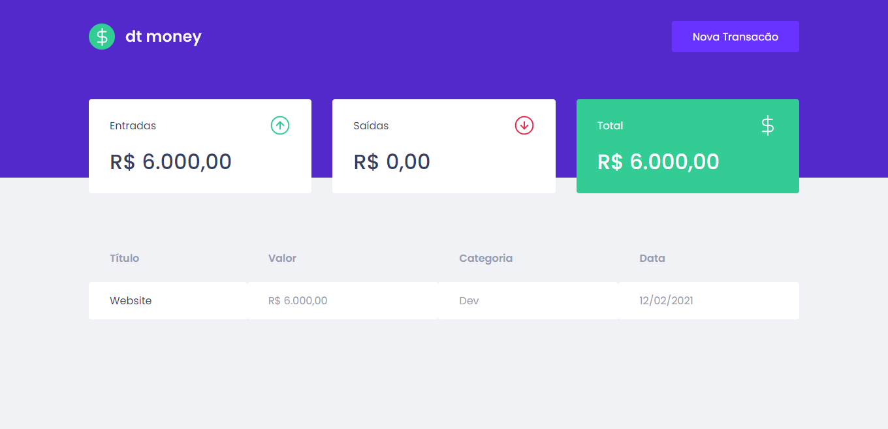

<div align="center">
  <h1>Dt money</h1>
</div>

<p align="center">
  <a href="#-technologies">Technologies</a>&nbsp;&nbsp;&nbsp;|&nbsp;&nbsp;&nbsp;
  <a href="#-layout">Getting started</a>&nbsp;&nbsp;&nbsp;|&nbsp;&nbsp;&nbsp;
  <a href="#-project">Project</a>&nbsp;&nbsp;&nbsp;|&nbsp;&nbsp;&nbsp;
  <a href="#-layout">Layout</a>&nbsp;&nbsp;&nbsp;|&nbsp;&nbsp;&nbsp;
  <a href="#-license">License</a>
</p>

<p align="center">
  
  
  

  
</p>

<br>

<div align="center">
  
</div>

---

## 🧪 Technologies

This project was developed using the following technologies:

-   [React JS](https://reactjs.org/)
-   [TypeScript](https://www.typescriptlang.org/)

## 🚀 Getting started

Clone the project and access the folder

```bash
$ git clone https://github.com/victortxc/plantmanager.git && cd plantmanager
```

Follow the steps below

```bash
# Install the dependencies
$ npm install

# Start the project
$ yarn start
```

## 💻 Project

Dt money is a project for personal finance 🤑.

This is a project developed during the **[Ignite](https://rocketseat.com.br/ignite)**, presented by **[@Rocketseat](https://github.com/Rocketseat)**.

## 🔖 Layout

You can view the project layout through the links below:

-   [Layout](https://www.figma.com/file/0xmu9mj2TJYoIOubBFWsk5/dtmoney-Ignite-(Copy)?node-id=0%3A1)

## 📝 License

This project is licensed under the MIT License. See the [LICENSE](LICENSE.md) file for details.
